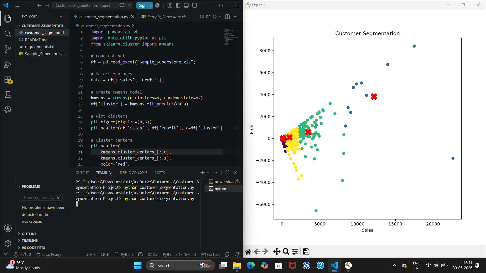

# Customer Segmentation Project

## Objective
Analyze customer purchasing behavior using K-Means Clustering.

## Tools Used
- Python
- Pandas
- NumPy
- Matplotlib
- Scikit-learn

## Dataset
Sample_Superstore.xls

## Output

## Author
Devadharshini E
